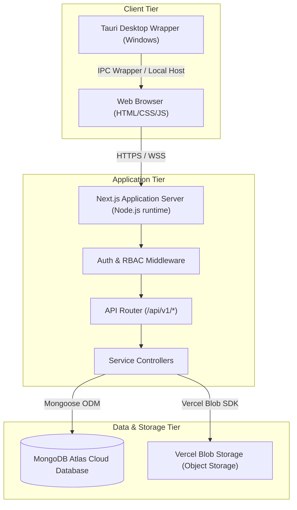
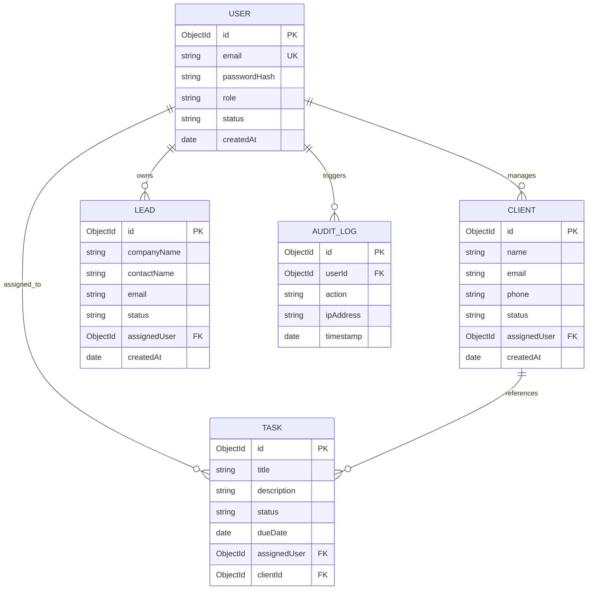
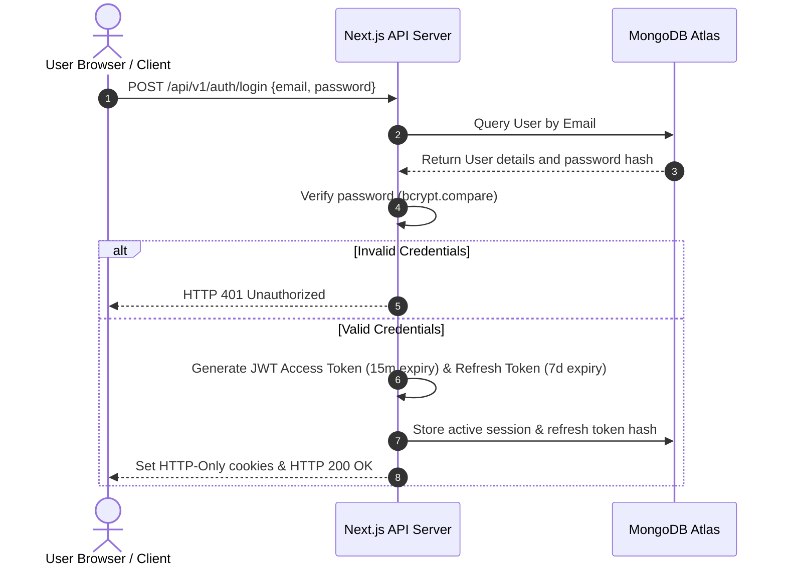
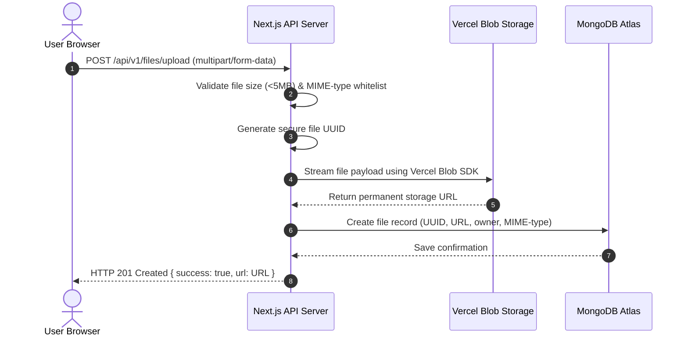
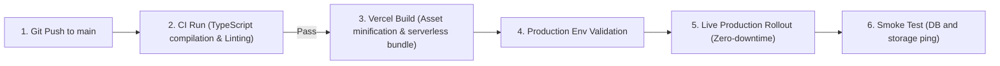

# Technology Architecture Blueprint: Allurite CRM

This document details the production-ready technical architecture, folder structure, system data flows, and runtime specifications for the Allurite CRM ecosystem.

---

## 1. System Architecture Diagram



---

## 2. Frontend Structure

The frontend layer is built with high performance, visual consistency, and responsive layouts in mind, using standard CSS variables and semantic HTML.

```
/src/
├── app/                  # Next.js App Router (Layouts and Pages)
│   ├── api/              # API route definitions
│   ├── dashboard/        # Authenticated workspace routes
│   ├── login/            # Authentication interface
│   └── layout.tsx        # Base HTML and global design tokens
├── components/           # Core isolated components
│   ├── layout/           # Sidebar, Topbar, and PageContainer
│   └── ui/               # Design System controls (Buttons, Cards, Inputs)
├── features/             # Business domain modules
│   ├── leads/            # Lead feature context and UI
│   ├── clients/          # Client feature context and UI
│   ├── tasks/            # Task orchestration feature
│   └── settings/         # CRM configurations
├── hooks/                # Global React hooks (useAuth, etc.)
├── providers/            # React Context providers (Theme, Auth, Language)
└── styles/               # Global stylesheet and custom themes
```

---

## 3. Backend Structure

The application backend runs on a serverless Node.js environment integrated into the Next.js framework, strictly maintaining separate layers for controllers, services, and models.

```
/src/
├── app/api/v1/           # REST Endpoint Controllers
├── models/               # MongoDB Mongoose Schema definitions
│   ├── User.ts
│   ├── Client.ts
│   ├── Lead.ts
│   ├── Task.ts
│   └── AuditLog.ts
├── lib/                  # Server configuration and database clients
│   ├── db.ts             # MongoDB client initialization
│   ├── auth.ts           # JWT and encryption utils
│   └── storage.ts        # Vercel Blob client wrapper
├── middlewares/          # Security and validation middlewares
│   ├── auth.ts           # Session validation
│   └── rbac.ts           # Permission boundary checks
└── services/             # Core business logic handlers
```

---

## 4. Database Structure (MongoDB Atlas)

Allurite CRM relies exclusively on MongoDB Atlas. Data relationships are defined via Mongoose schemas with indexes for high-speed reads.



---

## 5. Authentication Flow



---

## 6. Authorization Flow (RBAC)

1. **Request Interception**: The client makes an authenticated request carrying a JWT cookie.
2. **Token Verification**: Middleware parses and validates the signature of the JWT token.
3. **Role Validation**:
   - The token contains the User's `role` (e.g. `Manager`, `Employee`).
   - The route handler configures a permission check via the RBAC middleware. Example: `rbacMiddleware(['create:leads'])`.
4. **Endpoint Resolution**: If the role is authorized, execution proceeds. Otherwise, a `403 Forbidden` JSON envelope is immediately returned.

---

## 7. File Upload Flow (Vercel Blob)

All files (documents, client assets, images) must use Vercel Blob. No local storage is used in production.



---

## 8. Notification Flow

1. **Trigger Event**: A state change occurs (e.g., a task is assigned, a lead changes status).
2. **Database Record Creation**: The service layer writes a notification record to the MongoDB `notifications` collection with `read: false`.
3. **Delivery Mechanism**:
   - **Active Sessions**: A server-sent event (SSE) stream or WebSocket connection pushes the notification payload to active clients instantly.
   - **UI Rendering**: The client UI intercepts the notification event, updates the badges without reloading, and displays a localized alert.

---

## 9. Backup Flow (MongoDB Atlas)

- **Execution Tier**: Handled entirely at the MongoDB Atlas infrastructure layer.
- **Frequency**: Automatic snapshot backups taken every 24 hours.
- **Retention**: Daily snapshots retained for 7 days, weekly snapshots retained for 4 weeks, monthly snapshots retained for 12 months.
- **Continuous Backups**: Point-in-Time Recovery (PITR) enabled on production clusters to allow database state restoration to any exact second within the last 7 days.

---

## 10. Desktop App Flow (Tauri Wrapper)

- **Frontend Hosting**: Tauri loads compiled assets directly from the application package (`localhost` origin via custom protocol) to prevent external scripting vulnerabilities.
- **System Communications**: Whenever system resources (local file paths, system alerts, hardware APIs) are needed, the frontend triggers a typed IPC command: `invoke('command_name', { args })`.
- **Backend Sync**: Tauri's frontend communicates with the remote Next.js production backend over standard HTTPS endpoints.

---

## 11. Deployment Flow


